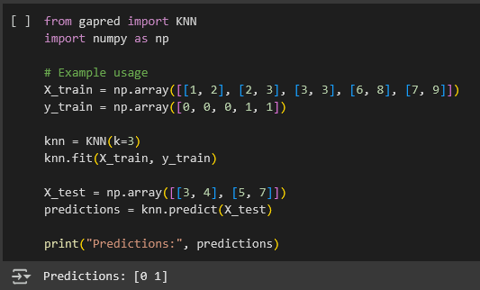
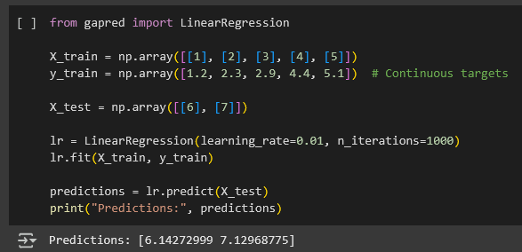
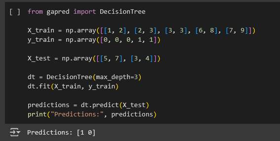
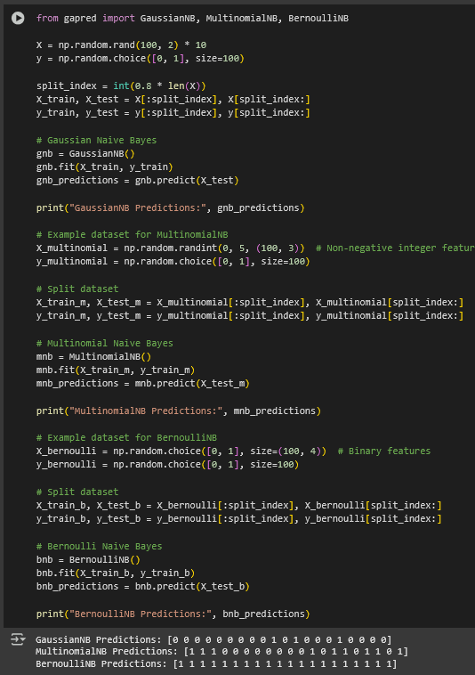

#Gapred

PyPi Link: https://pypi.org/project/gapred/

## Sample use

Currently gapred supports 5 ml models(knn, linear regression, decision tree, random forest and naive bayes)

## Usage
run `pip install gapred` in your python environment

##Sample usage

KNN

Linear Regression

Decision tree

Naive Bayes

Random Forest
